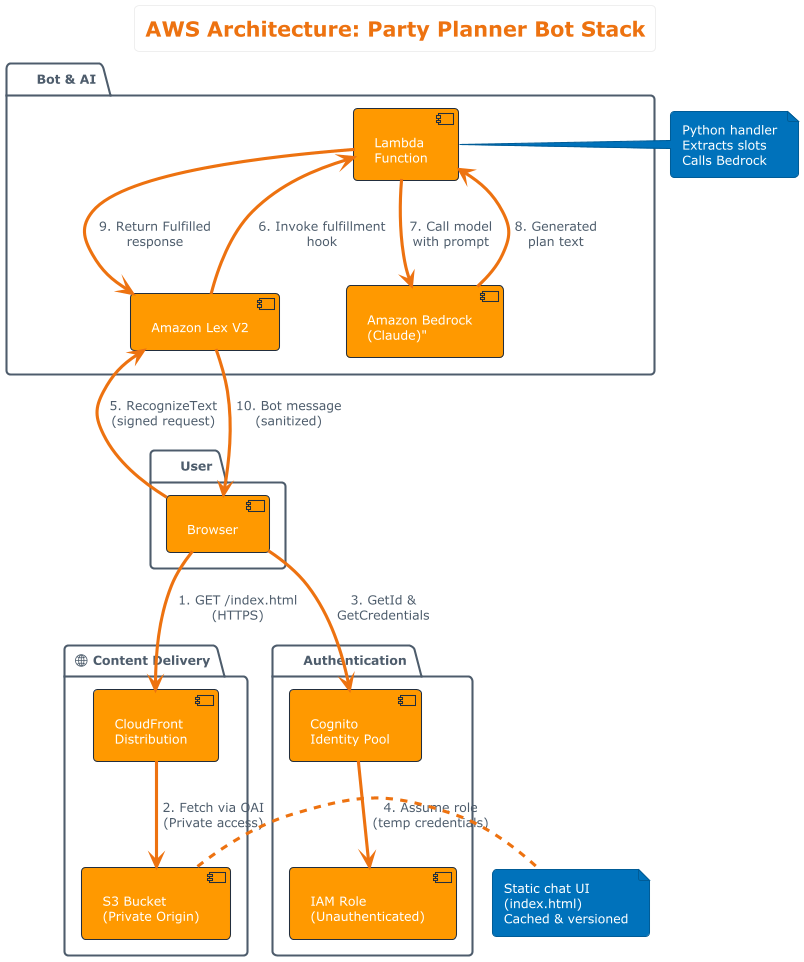
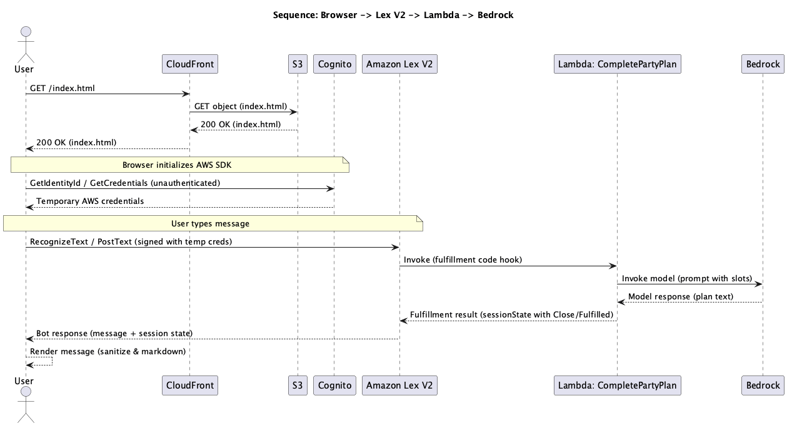

# Party Planner Bot — AWS Architecture

This repository contains a demo stack for a browser-based chat UI that calls Amazon Lex V2. The diagrams below show the architecture and request flow.

## Architecture Diagram

The stack includes:

- **CloudFront + S3**: Static chat UI (index.html) served via CDN with private S3 origin and OAI
- **Cognito Identity Pool**: Unauthenticated identities for browser access
- **Amazon Lex V2**: Conversational bot with `CompletePartyPlan` intent
- **Lambda**: Fulfillment handler that extracts slots and calls Bedrock
- **Amazon Bedrock**: Claude LLM to generate personalized party plans

## Sequence Diagram

The sequence shows the request flow:

1. Browser fetches `index.html` from CloudFront
2. Browser authenticates with Cognito (unauthenticated identity)
3. Browser sends message to Lex V2 (signed with temporary credentials)
4. Lex invokes Lambda fulfillment hook
5. Lambda calls Bedrock with a prompt built from Lex slots
6. Bedrock returns the generated plan
7. Lambda returns the fulfillment result to Lex
8. Lex returns the bot response to the browser
9. Browser renders the message as sanitized Markdown

