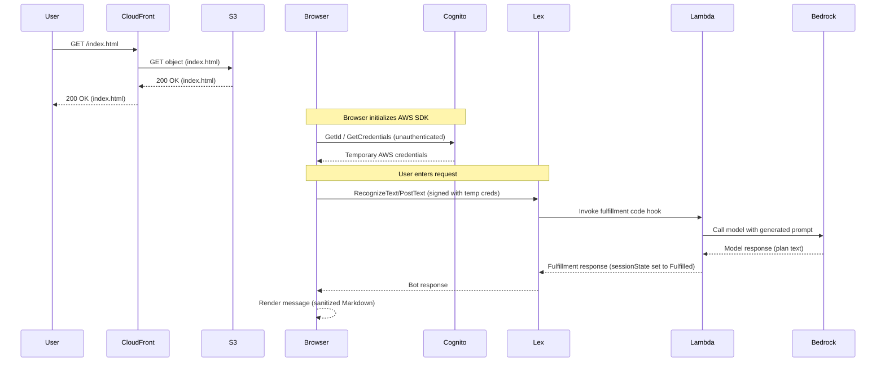

# Sequence Diagram — CompletePartyPlan flow

This repository contains a demo stack for a browser-based chat UI that calls Amazon Lex V2. The sequence diagram below shows how a user interacts with the hosted static site and how Lex delegates fulfillment to a Lambda which calls Bedrock to generate the party plan.

Files

- `diagrams/sequence.puml` — PlantUML source for the same sequence diagram.

Notes

- The Mermaid diagram above renders on GitHub and many Markdown viewers. The PlantUML file can be used to generate PNG/SVG using PlantUML.
- This diagram assumes the static site is served via CloudFront (private S3 origin, OAI), the browser uses an unauthenticated Cognito Identity Pool to obtain temporary credentials, and Lex V2 calls the Lambda fulfillment hook which in turn calls Bedrock (via an SDK) to generate the plan.
